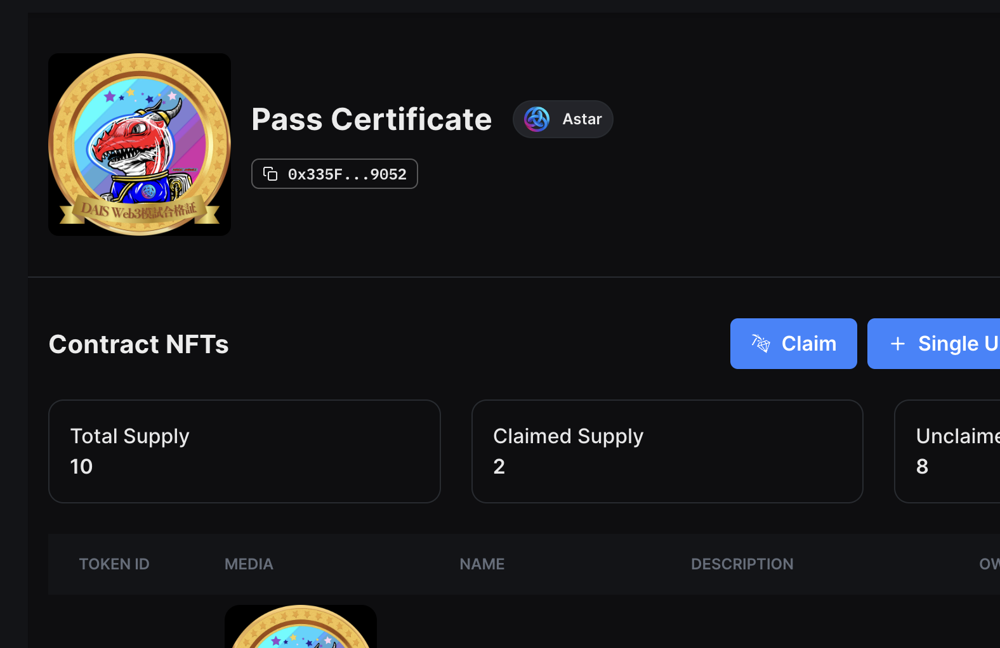
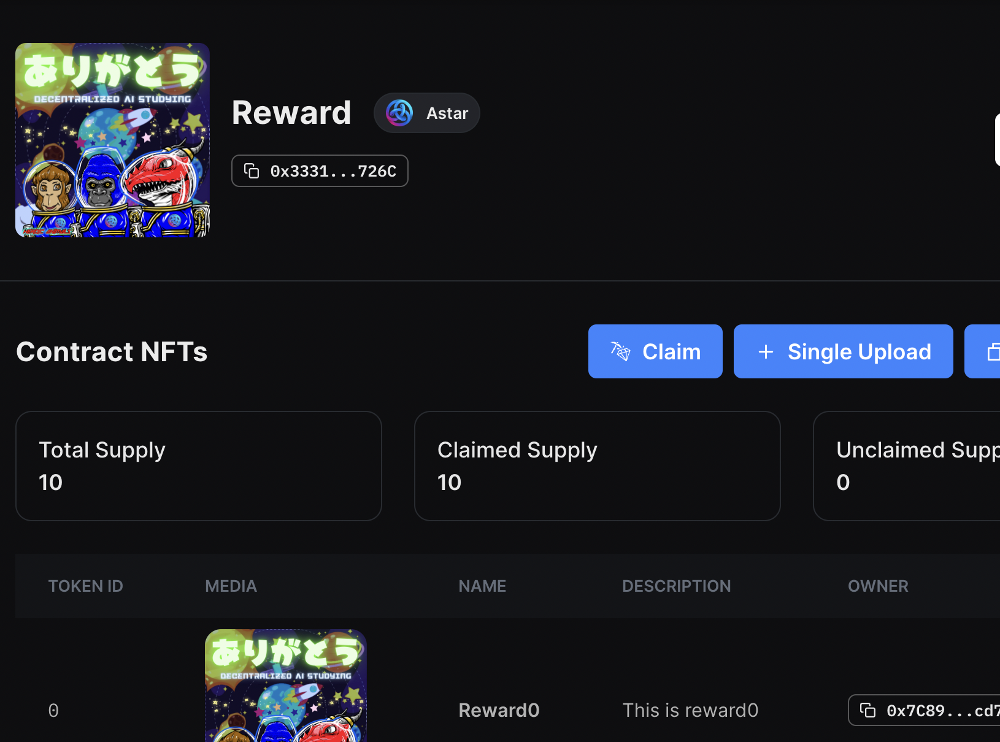

# 1 デプロイ方法

以下のコマンドを実行する。
```
npx thirdweb deploy
```
thirdwebが立ち上がるため、そのまま処理を実行。

# ２ メインコントラクト

https://thirdweb.com/astar/0x0af29Fa8394179661B4A24886452442E16eB180d/explorer

# 3 合格証NFT

https://thirdweb.com/astar/0x335F3DDf31c922234D4104DBE5fD83BFDc639052/nfts



なお、こちらの画像は、[HeroicAnimals](https://twitter.com/Heroic_Animals)さんからご好意で提供いただいたものになります。

# 4 リワードNFT

https://thirdweb.com/astar/0xa1ace383306CcB74F5263d94E28A4060057ED141/nfts



なお、こちらの画像も、[HeroicAnimals](https://twitter.com/Heroic_Animals)さんからご好意で提供いただいたものになります。

# 5 フロントエンド

このコントラクトを元にして作成した、Webページ、Githubは次の通りです。

### 1 Webページ

https://ai-crypto-hackathon-git-main-koshin01.vercel.app/

### 2 Github

https://github.com/koshin01/ai_crypto_hackathon


# 6 仕様一覧

## 1 問題作成関数 (setQuestion)

管理者のみが問題を作成できる。

問題番号と問題、解答を入力する。

```sol
function setQuestion(
        uint256 _number,
        string memory _question,
        string memory _answer
    ) public onlyRole(ADMIN_ROLE) {
        questionTextByQuestionNumber[_number] = _question;
        answerTextByQuestionNumber[_number] = _answer;

        emit QuestionSet(_number, _question, _answer);
}
```

## ２ コメント作成関数 (setCommentForQuestionNumber)

誰でもコメントが可能。

どの問題番号についてかを入力し、コメントを行う。

```sol
function setCommentForQuestionNumber(
        uint256 comment_number,
        string memory _comment
    ) public {
        commentCount++;
        commentCountByQuestion[comment_number]++;
        commentCountByAddress[msg.sender]++;
        indexedCommentForQuestionNumber[comment_number][commentCountByQuestion[comment_number]] = _comment;
        commentByAddressForCommentNumber[msg.sender][commentCountByAddress[msg.sender]] = _comment;

        emit CommentSet(msg.sender, block.timestamp, _comment);
}
```

## 3 投票可能者設定関数 (setWhitelistUsers)

管理者のみがホワイトリストを作成できる。

Questionには、誤りがある可能性がある。

問題を変更したいと考えた場合、その問題に対して、投票ができる。

しかし、誰でも投票できることを防ぐため、ホワイトリストを作成し、ホワイトリスト登録者のみが投票できる。

```sol
function setWhitelistUsers(address[] calldata _users) public onlyRole(ADMIN_ROLE) {
        delete whitelistedAddresses;
        whitelistedAddresses = _users;
    }
```

## 4 投票可能者関数 (isWhitelisted)

投票者がホワイトリストに登録されているかをチェックする。

```sol
function isWhitelisted(address _user) public view returns (bool) {
        for (uint i = 0; i < whitelistedAddresses.length; i++) {
            if (whitelistedAddresses[i] == _user) {
                return true;
            }
        }
        return false;
}
```

## 5 合格証NFT所有数確認関数 (getErc721Balance)

別の合格証コントラクトのNFTの所持数を取得する。

合格証コントラクトはコンストラクタで設定済み。

```sol
function getErc721Balance(address user) public view returns (uint256) {
        return erc721Contract.balanceOf(user);
}
```

## 6 有効ユーザー確認関数 (isValidUser)

ホワイトリストに登録されている、もしくは合格証NFTを所持している場合はtrueを返す。

```sol
function isValidUser(address _user) public view returns (bool) {
        if(isWhitelisted(_user) || getErc721Balance(_user) > 0) {
            return true;
        }
        return false;
}
```

## 7 投票実行関数 (submitVoteForQuestionNumber)

有効なユーザーのみが投票を行うことができる。

一つの問題に対し、１回までしか投票することができない。

有効投票数に達した時にイベントを発火する。

```sol
function submitVoteForQuestionNumber (uint256 _number) public {
        require(isValidUser(msg.sender), "user is not valid");
        require(voteCountByAddressForQuestionNumber[msg.sender][_number] == 0, "you already set favor");
        voteCountForQuestionNumber[_number]++;
        voteCountByAddressForQuestionNumber[msg.sender][_number]++;
        // 有効投票数の達した時にイベント発生
        if ( voteCountForQuestionNumber[_number] == validVotesNumber ) {
            emit ValidVoteSet(_number);
        }
}
```

## 8 問題変更関数 (changeQuestion)

有効なユーザーかつ投票者のみが問題を作成できる。

問題が変更された場合に、イベントが発火される。

```sol
function changeQuestion(
        uint256 _number,
        string memory _question,
        string memory _answer
    ) public {
        require(voteCountForQuestionNumber[_number] >= validVotesNumber, "favorNumber is too low");
        require(isValidUser(msg.sender), "user is not valid");
        require(voteCountByAddressForQuestionNumber[msg.sender][_number] == 1, "you didn't do favor");
        questionTextByQuestionNumber[_number] = _question;
        answerTextByQuestionNumber[_number] = _answer;
        isValidRewardAddress[msg.sender] = true;
        emit QuestionSet(_number, _question, _answer);
}
```

## 9 管理者権限設定関数 (addAdmin)

管理者権限を設定する。

管理者は問題の作成とホワイトリストの登録が可能になる。

```sol
function addAdmin(address admin) public onlyOwner {
        _grantRole(ADMIN_ROLE, admin);
}
```

## 10 リワード関数 (requestReward)

問題変更者のみが実施できる。

外部のコントラクトのsafeTransferFrom関数を実施し、実行者に対してNFTを送付する。

```sol
function requestReward() public {
        require(isValidRewardAddress[msg.sender], "you are not valid");
        erc721RewardContract.safeTransferFrom(address(this), msg.sender, rewardCount);
        rewardCount++;
        isValidRewardAddress[msg.sender] = false;
}
```
## 11 全問題取得関数 (getAllQuestions)

全ての問題を取得できる。

```sol
function getAllQuestions() public view returns (string[] memory) {
        string[] memory questions = new string[](questionCount);
        for (uint i = 0; i < questionCount; i++) {
            questions[i] = questionTextByQuestionNumber[i + 1];
        }
        return questions;
}
```

## 12 全解答取得関数 (getAllAnswers)

全ての問題を取得できる。

```sol
function getAllAnswers() public view returns (string[] memory) {
        string[] memory answers = new string[](answerCount);
        for (uint i = 0; i < answerCount; i++) {
            answers[i] = answerTextByQuestionNumber[i + 1];
        }
        return answers;
}
```


## Getting Started

Create a project using this example:

```bash
npx thirdweb create --contract --template hardhat-javascript-starter
```

You can start editing the page by modifying `contracts/Contract.sol`.

To add functionality to your contracts, you can use the `@thirdweb-dev/contracts` package which provides base contracts and extensions to inherit. The package is already installed with this project. Head to our [Contracts Extensions Docs](https://portal.thirdweb.com/contractkit) to learn more.

## Building the project

After any changes to the contract, run:

```bash
npm run build
# or
yarn build
```

to compile your contracts. This will also detect the [Contracts Extensions Docs](https://portal.thirdweb.com/contractkit) detected on your contract.

## Deploying Contracts

When you're ready to deploy your contracts, just run one of the following command to deploy you're contracts:

```bash
npm run deploy
# or
yarn deploy
```

## Releasing Contracts

If you want to release a version of your contracts publicly, you can use one of the followings command:

```bash
npm run release
# or
yarn release
```

## Join our Discord!

For any questions, suggestions, join our discord at [https://discord.gg/thirdweb](https://discord.gg/thirdweb).